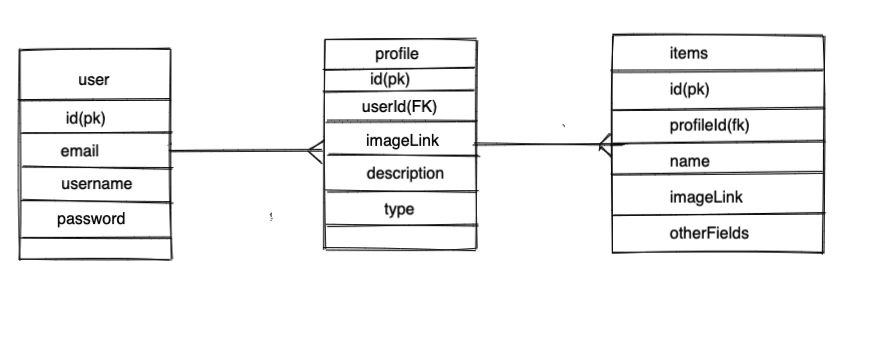
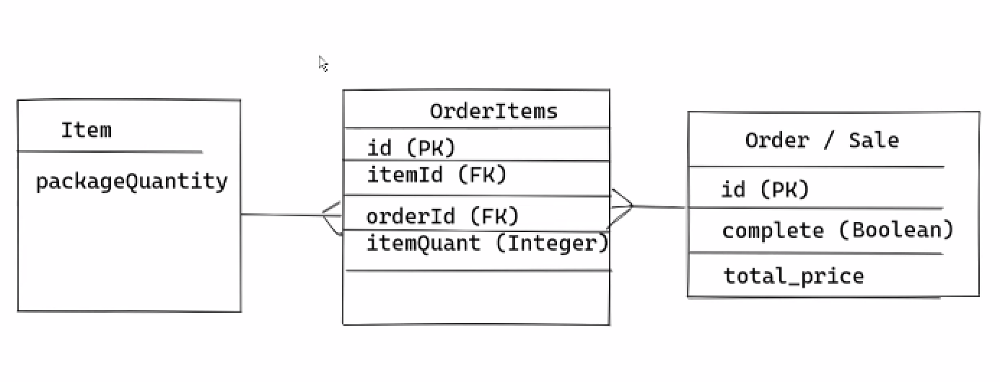

# Project name: Stock Pile

## Project link: 
........

## Project description:
**Stock Pile** is an Inventory management type of website where the user is supposed to be a business user that uses an app to add goods to the database and manage the quantity of the goods. When a user has to manage lots of items in the stock and if needed to track the quantity of the items, so that they are ready for the sale for the week, this apps solves that problem. This app helps to track the quantity of the items and just before sale gives a message that there is a limited quantity for certain items and also helps organize the items in the stock.

## Technologies used:
- Language: EJS, CSS, JS, node.js
- Framework: express
- Database: Postgresql
- Other Technologies: Bootstrap, jQuery

## User stories:
1. Navigate to "/" and see a basic splash page with:
- The name of the website.
- Links to "Log In" and "Sign Up".
2. Sign up for an account.
3. Log in to their account if they already have one.
4. As a user, user can start a business and add items or inventory to their business show page.
5. As a user, user can add items with details related to price and quantity.
6. As a user, user can create an order if any and add some details to it.
7. As a user, user can add items to with certain quantity as required.
8. As a user, user can update the quantity of the items if the order is made.
9. As a user, user can see the bills of sales if the order is complete with the total price earned from that order.
10. As a user, users can have all CRUD functionaliy to manage the order,items,business,etc.

## Wireframes:

**Homepage**

**Business page**

**Business Form page**

**ItemsForm page**

**Items page**

**ERD**

